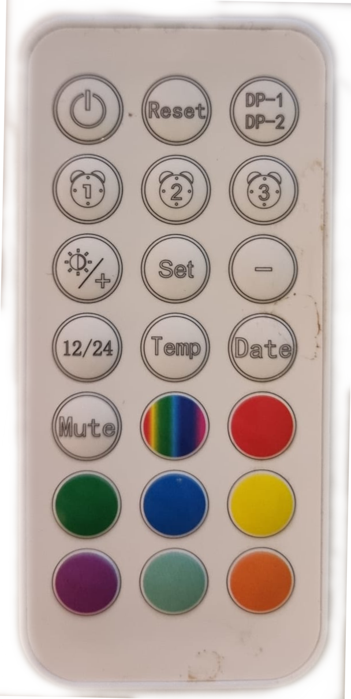

## DecodeAuriolRC
Decodes IR Remote Control Auriol codes for each button:

|   |   |   |
|---|---|---|
| **A1**  [&nbsp;&nbsp;93]| **B1** [157] | **C1**  [&nbsp;&nbsp;29]|
| **A2**  [&nbsp;221]| **B2**  [&nbsp;253]| **C2**  [&nbsp;&nbsp;61]|
| **A3**  [&nbsp;&nbsp;31]| **B3** [&nbsp;&nbsp;21]| **C3**  [&nbsp;&nbsp;9]|
| **A4*** [&nbsp;&nbsp;22]|  **B4**  [&nbsp;25]| **C4**  [&nbsp;13]|
|     **A5** [&nbsp;12]| **B5** [&nbsp;&nbsp;24]| **C5** [&nbsp;133]     |
| **A6** [&nbsp;&nbsp;8]|  **B6**  [&nbsp;199]| **C6**  [&nbsp;165]|
|     **A7** [189| **B7** [181]| **C7** [173]    | 
 
 

 

## additional information
* Packaged with [Auriol LED clock with alarm](https://www.lidl.nl/p/auriol-led-klok-met-wekker/p100391320) 
* IR button codes decoded with [ShowRawIRCode](../ShowRawIRCode)
* Added to [RemoteControlMapping](https://github.com/RoboraceMSW/RemoteControlMapping/)

## Gebruiken als extensie

#### Metadata (gebruikt voor zoeken, rendering)

* for PXT/microbit

#### Metadata (gebruikt voor zoeken, rendering)

* for PXT/microbit

